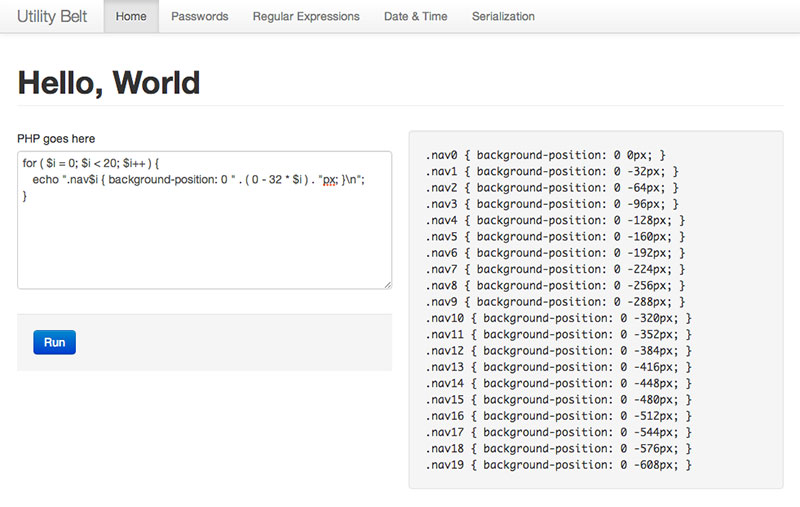
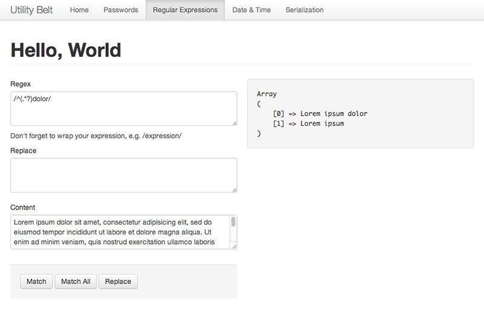
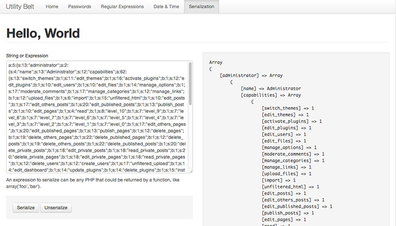

# PHP Utility Belt

A set of tools for PHP developers. Install in a browser-accessible directory and have at it.

## WARNING

This application allows you to run arbitrary PHP code and is intended to be hosted locally on a development machine. Therefore, it **SHOULD NEVER EXIST IN A PRODUCTION ENVIRONMENT OR PUBLICALLY ACCESSIBLE ENVIRONMENT**. You've been warned.

## Features

* Run arbitrary PHP off the main page

* Test regular expressions out instantly and see the matches from preg_match and preg_match_all, or see the results from a preg_replate

* Get 10 random passwords containing two words, two digits, a capital letter, and a symbol
* Serialize and unserialize

* Test date formats against timestamps from mktime, strtotime, or a numeric timestamp

## Author

**Matt Boynes**

* http://twitter.com/senyob
* http://github.com/mboynes

## Copyright and license

Copyright 2012 Matthew Boynes

Licensed under the Apache License, Version 2.0 (the "License");
you may not use this work except in compliance with the License.
You may obtain a copy of the License in the LICENSE file, or at:

   http://www.apache.org/licenses/LICENSE-2.0

Unless required by applicable law or agreed to in writing, software
distributed under the License is distributed on an "AS IS" BASIS,
WITHOUT WARRANTIES OR CONDITIONS OF ANY KIND, either express or implied.
See the License for the specific language governing permissions and
limitations under the License.